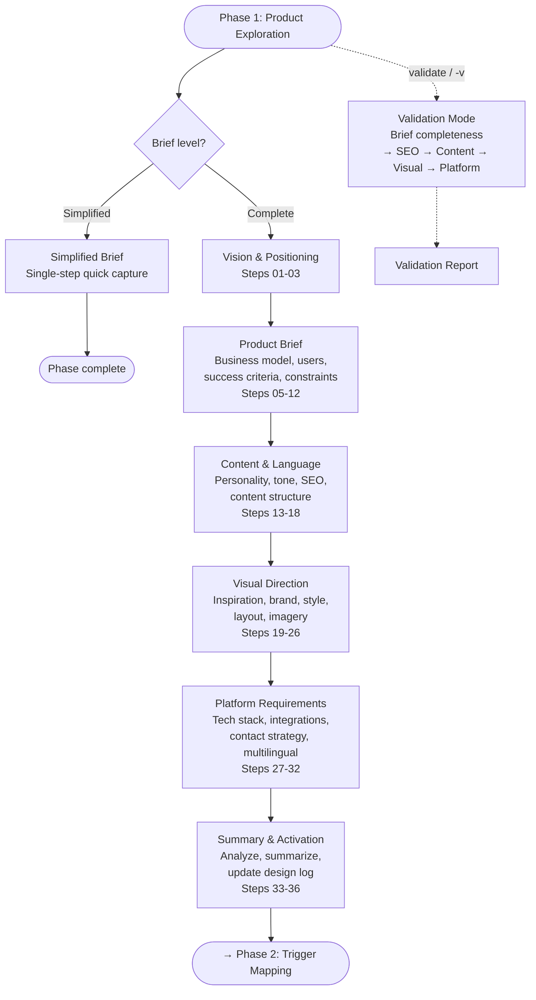

# Phase 1: Product Exploration

**Agent:** Saga the Analyst  
**Output:** `A-Product-Brief/` (or your configured prefix)

---

## What This Phase Does

Product Exploration establishes your strategic foundation through conversational discovery. Instead of filling out questionnaires, you have a conversation that builds understanding organically.

By the end, you'll have a Product Brief that captures your vision and serves as the north star for your entire project.

---

## What You'll Create

Your Product Brief includes:

- **Executive Summary** - The vision that inspires teams
- **Problem Statement** - The "why" that drives decisions
- **User Types** - The "who" that guides design (initial identification)
- **Solution Approach** - The "how" that enables development
- **Success Criteria** - The "what" that measures progress
- **Market Positioning** - How you're different (optional: ICP framework)

Phase 1 captures a casual, conversational understanding of the business — who the users are, what the goals are, what the product should do. The deep strategic analysis (personas, driving forces, prioritization) happens in Phase 2: Trigger Mapping.

---

## Workflow Structure

Phase 1 follows a linear path through four document modules, with an optional simplified mode:

**Four document modules** — each produces its own output file:
1. **Product Brief** — vision, business model, users, success criteria
2. **Content & Language** — personality, tone, SEO keywords, structure
3. **Visual Direction** — brand, style references, layout, imagery
4. **Platform Requirements** — tech stack, integrations, multilingual

Phase 1 captures casual business context. Deep strategic analysis (personas, driving forces) is done in Phase 2: Trigger Mapping.

---

## How It Works

### The Conversational Approach

Traditional requirements gathering treats people like databases - extracting answers through rigid questionnaires. WDS does it differently.

**Instead of:** "Please complete this 47-question requirements document"

**WDS says:** "Tell me about your project in your own words"

People light up when asked to share their vision. They become collaborators, not interrogation subjects.

### The Session Flow

**Opening (5-10 minutes)**

Saga asks about your project in your own words. She listens for:

- What you emphasize naturally
- Where your energy goes
- What excites vs. what stresses you
- Your exact language and terminology

**Exploration (15-30 minutes)**

The conversation adapts to what you reveal:

- If you mention users → deeper into user insights
- If you mention problems → explore the cost of not solving
- If you mention competition → discover differentiation
- If you mention timeline → understand urgency drivers

Each answer reveals the next question. It's jazz, not classical music.

**Synthesis (10-15 minutes)**

Saga reflects back your vision in organized form:

- Connecting dots you shared across topics
- Highlighting insights you might not have seen
- Building the foundation for next phases

### Living Document

As you talk, the Product Brief grows in real-time:

- Immediate validation and refinement
- Real-time course correction
- You own the content because you helped create it
- "Yes, exactly!" moments that build trust

---

## When to Use This Phase

**Always start here if:**

- Building something new
- Starting a new project
- Need strategic clarity before diving into design

**Skip if:**

- You already have a clear, documented product brief
- Just enhancing an existing feature
- Working on a design system without new product context

---

## What to Prepare

Come ready to share:

- Your project idea (even if rough)
- The problem you're solving
- Who might use it
- Why it matters to you

You don't need polished answers. The conversation will help clarify everything.

---

## What Comes Next

Your Product Brief enables:

- **Phase 2: Trigger Mapping** - Deep user psychology (personas, driving forces, prioritization)
- **Phase 3: UX Scenarios** - User journeys grounded in your vision
- **Phase 4: UX Design** - Design work grounded in strategic purpose

The brief becomes the reference point everyone shares.

---

## Tips for Great Sessions

**Let the conversation flow**

- Share what feels important, even if it seems tangential
- Follow your energy - where you're excited matters

**Think out loud**

- Half-formed thoughts are welcome
- will help you refine them

**Be honest about uncertainty**

- "I'm not sure about X" is useful information
- Better to surface doubts now than later

**Review as you go**

- Check that what's captured matches your thinking
- Correct misunderstandings immediately

---

## Example Output

See: `examples/dog-week-patterns/A-Product-Brief/` for a complete Product Brief example from a real project.

---

## Related Resources

**Method Guides:**
- [Phase 2: Trigger Mapping Guide](./phase-2-trigger-mapping-guide.md) - Deep user psychology (next phase)
- [Phase 3: UX Scenarios Guide](./phase-3-ux-scenarios-guide.md) - User journeys from Trigger Map

**Strategic Models:**
- [Customer Awareness Cycle](../models/customer-awareness-cycle.md) - Understanding user awareness stages
- [Golden Circle](../models/golden-circle.md) - WHY, HOW, WHAT framework (useful for vision)

**Workflows:**
- Product Brief Workflow: `workflows/1-project-brief/project-brief/complete/workflow.md`
- Pitch & Signoff Workflow: `workflows/1-project-brief/alignment-signoff/workflow.md`

---

_Phase 1 of the Whiteport Design Studio method_
