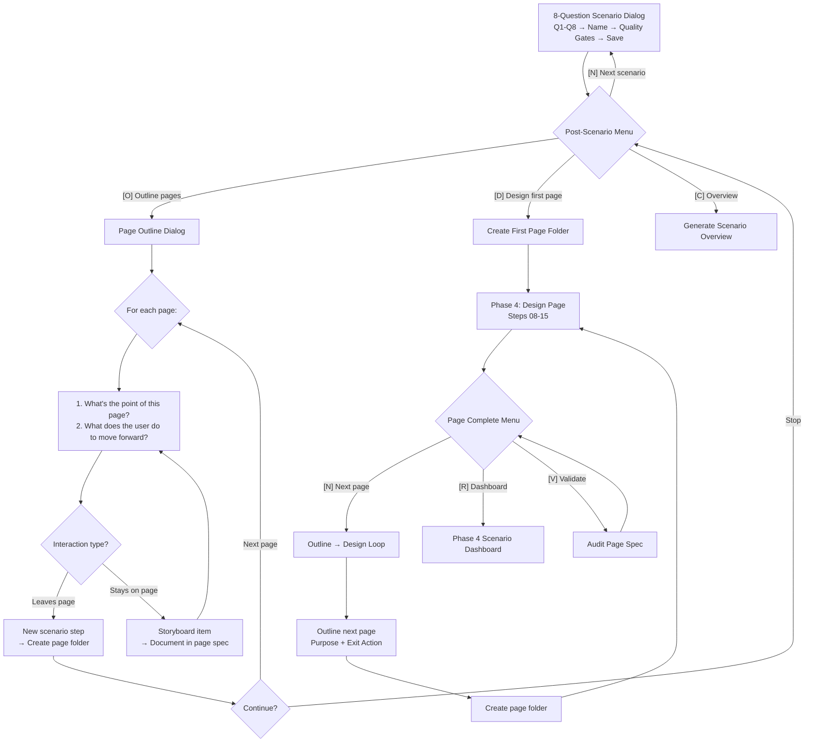

# Phase 3: UX Scenarios (Scenario Outlines)

**Agent:** Saga the Analyst
**Output:** `C-UX-Scenarios/` (in your configured design artifacts folder)

---

## What This Phase Does

UX Scenarios transforms your Trigger Map into concrete user journeys. Through the **8-question scenario dialog**, you define each meaningful transaction a user performs on your site — starting with the most important one.

By the end, you'll have scenario outlines that ground every design decision in real user psychology and business goals.

---

## The 8-Question Scenario Dialog

This is the core of Phase 3. For each scenario, you walk through 8 strategic questions — one at a time, as a natural conversation:

| # | Question | What it establishes |
|---|----------|-------------------|
| Q1 | "What transaction do we need to get really right?" | The key user journey |
| Q2 | "Which business goal does it serve?" | Trigger Map connection |
| Q3 | "Which user, and in what real-life situation?" | Persona + context |
| Q4 | "What do they want and fear going into this?" | Driving forces |
| Q5 | "What device are they on?" | Platform |
| Q6 | "What's the natural starting point?" | Entry point + discovery |
| Q7 | "What's the best possible outcome — for both sides?" | Mutual success |
| Q8 | "What's the shortest path through the site?" | Linear sunshine path |

**What counts as a transaction:** Not just purchases or bookings. Clicking through a menu item by item to research site content is a transaction. Comparing options is a transaction. Any meaningful journey where the user moves through the site with intent.

### Two Modes

- **Conversation mode** (default): Saga asks, you answer. One question at a time. Each answer shapes the next question naturally.
- **Suggest mode**: Saga answers all 8 questions based on the Trigger Map and Product Brief. You review and adjust.

---

## The Scenario → Page Flow

After the 8 questions define a scenario, the process continues with page outlining and design:



### The Page Outline Dialog

For each page in the scenario, ask two questions:

**1. "What's the point of this page?"**
What does the user need to accomplish here?
- e.g., "See a list of news articles" or "Find the phone number and opening hours"

**2. "What does the user do to move forward?"**
What interaction takes them to the next step?
- e.g., "Selects 'News' in the menu" → next page is the News listing

**Two types of interactions:**
- **Leaves the page** → new scenario step (new page folder)
- **Stays on the page** → storyboard item (documented within the page spec)

### The Outline → Design Loop

After designing a page in Phase 4, the user can choose [N] to outline and design the next page. This creates a continuous loop:

1. **Outline** the next page (purpose + exit action)
2. **Create** the page folder with boilerplate spec
3. **Design** the page (Phase 4 steps 08-15)
4. **Repeat** until all pages are done

---

## Page Folder Structure

Each page gets its own folder with a spec and a Sketches subfolder:

```
C-UX-Scenarios/01-hasses-emergency-search/
├── 01-hasses-emergency-search.md         # Scenario outline
└── pages/
    ├── 01.1-start-page/
    │   ├── 01.1-start-page.md            # Full boilerplate
    │   └── Sketches/
    ├── 01.2-services/
    │   ├── 01.2-services.md              # Minimal boilerplate
    │   └── Sketches/
    └── 01.3-contact/
        ├── 01.3-contact.md               # Minimal boilerplate
        └── Sketches/
```

**Naming convention:** `{scenario-number}.{step-number}-{page-slug}`

The **first page** gets rich context from the 8-question dialog (device, arrival method, mental state, user situation). Remaining pages get minimal boilerplate with page purpose.

---

## What You'll Create

- **Scenario outlines** — one per transaction, grounded in Trigger Map personas and business goals
- **Page folders** — structured boilerplate specs ready for Phase 4 design
- **Scenario overview** — summary of all scenarios with page assignments

---

## Post-Scenario Options

After each scenario, you choose:

| Option | What happens |
|--------|-------------|
| **[N] Next scenario** | Define the next transaction for the next target group |
| **[O] Outline pages** | Walk through pages one at a time, creating folders |
| **[D] Design first page** | Create first page folder and jump to Phase 4 |
| **[C] Continue** | Generate scenario overview (when all are done) |

---

## Quality Gates

Before moving on from a scenario, Saga verifies:

- All 8 questions answered with specific, concrete responses
- Mental state is visceral and specific (not generic "interested")
- Entry point is realistic with device + context + discovery method
- Path is truly linear (zero "if" statements, zero branches)
- Both successes are specific and measurable
- Scenario name includes persona name
- Trigger Map connection is explicit

---

## When to Use This Phase

**Always use this phase** — it's the bridge between strategy (Phases 1-2) and design (Phase 4). Without scenarios, page design lacks context and purpose.

**Process scenarios in priority order:**
1. Primary transaction for primary target group
2. Secondary transactions
3. Tertiary/edge case transactions

---

## What to Prepare

Bring:
- **Product Brief** (Phase 1) — strategic context
- **Trigger Map** (Phase 2) — personas, driving forces, business goals
- **Page inventory** — known pages from the Trigger Map's feature analysis

---

## Connection to Phase 4

Phase 3 scenarios feed directly into Phase 4 design:

- **Scenario gate**: Phase 4 checks for existing scenarios before page design. No scenario? It redirects you back to Phase 3.
- **Page handover**: The first page spec includes device, mental state, and entry context — everything Freya needs to start designing.
- **Outline → Design loop**: After designing a page, you can outline the next one and continue designing without leaving Phase 4.

---

_Phase 3 of the Whiteport Design Studio method_
