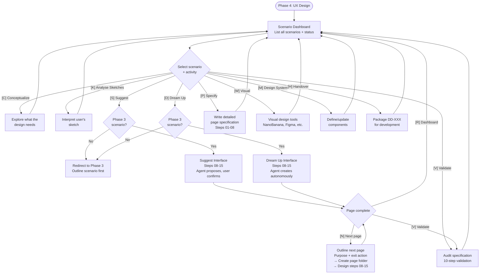

# Phase 4: UX Design (Page Specifications)

**Agent:** Freya the Designer
**Output:** `D-UX-Design/` (or your configured prefix)

---

## What This Phase Does

UX Design transforms scenarios into detailed visual specifications. Working with Freya, you conceptualize, sketch, and specify every interaction until your design can be logically explained without gaps.

**The key insight:** Designs that can be logically explained without gaps are easy to develop. The specification process reveals gaps in your thinking early - when they're easy to address.

---

## Scenario Gate

Phase 4 requires a Phase 3 scenario before page design can begin. When you start, Freya checks for existing scenarios in `C-UX-Scenarios/`.

- **If a scenario exists** — Freya loads the scenario context (8-question answers, shortest path, first page spec) and proceeds to design.
- **If no scenario exists** — Freya redirects you to Phase 3 to outline the scenario first. The 8-question dialog produces richer, more grounded scenarios than trying to shortcut the process.

This ensures every page is designed with purpose — grounded in a real user journey, connected to business goals.

---

## What You'll Create

For each scenario/page:

- **Page Specifications** - Complete documentation of each screen
- **Component Definitions** - Every element with Object IDs
- **Interaction Behaviors** - What happens when users interact
- **State Definitions** - All possible states for dynamic elements
- **HTML Prototypes** - Interactive prototypes for validation

---

## Workflow Structure

Phase 4 is **menu-driven**, not linear. You pick scenarios and activities from a dashboard:



**Key patterns:**
- **Scenario gate**: [S] Suggest and [D] Dream Up require a Phase 3 scenario — if none exists, you're redirected to Phase 3
- **Outline → Design loop**: After completing a page, [N] outlines and designs the next page continuously
- **Non-linear**: All other activities are available at any time from the dashboard

---

## Activities

Phase 4 activities from the dashboard:

```
What would you like to do?

[C] Conceptualize            — Explore what the design needs
[K] Analyse Sketches         — I'll interpret your sketch
[S] Suggest Interface        — I'll propose a design, checking each step
[D] Dream Up Interface       — I'll create it all, you review
[P] Write Specifications     — Detail a page specification
[W] Visual Design            — Work with visual tools, integrate results
[M] Manage Design System     — Define/update design system components
[V] Validate Specifications  — Audit a finished spec
[H] Design Delivery          — Package and hand off for development
```

### [C] Conceptualize

**When:** Starting a new page — before sketching begins

Freya helps you think through the user's journey, explore content and feature options, consider psychological triggers from your Trigger Map, and arrive at a clear solution ready for sketching.

### [K] Analyse Sketches

**When:** You have a sketch and need feedback

Freya analyzes what the sketch shows, asks clarifying questions, and identifies all components and states.

### [S] Suggest Interface

**When:** You want collaborative step-by-step design

Freya proposes each design decision, you confirm or adjust before moving on. Uses steps 08-15 to build the page specification incrementally.

### [D] Dream Up Interface

**When:** You trust Freya to make good decisions

Freya creates a complete page specification autonomously, then presents the result for your review. Uses the same steps as Suggest but with autonomous execution.

### [P] Write Specifications

**When:** Design is clear, need development-ready specs

Document every detail systematically — Object IDs, interactions, states, content.

### [W] Visual Design

**When:** Working with visual tools (Figma, design files)

Work with visual design tools and integrate results back into specifications.

### [M] Manage Design System

**When:** Extracting or updating reusable components

Define, update, or browse design system components as you design pages.

### [V] Validate Specifications

**When:** Auditing a finished spec for completeness

Check that specifications are complete, consistent, and development-ready.

### [H] Design Delivery

**When:** Ready to hand off for development

Package specifications for development handoff.

---

## The Outline → Design Loop

After designing a page (via [S] Suggest or [D] Dream Up), you choose what to do next:

```
Page complete! What would you like to do?

[N] Next page — outline and design the next step in this scenario
[R] Return to Scenario Dashboard — pick a different scenario or activity
[V] Validate — audit this page specification
```

When you choose **[N] Next page**, the flow is:

1. **Outline the next page** — "What's the point of this page?" and "What does the user do to move forward?"
2. **Create the page folder** with boilerplate spec and Sketches/ subfolder
3. **Design the page** — run steps 08-15
4. **After completion** — present this menu again

This loop continues until all pages in the scenario are designed or you choose to stop.

---

## The Scenario Structure

Scenarios from Phase 3 organize your design work into a clear hierarchy:

```
C-UX-Scenarios/
├── 01-hasses-emergency-search/
│   ├── 01-hasses-emergency-search.md     # Scenario outline
│   └── pages/
│       ├── 01.1-start-page/
│       │   ├── 01.1-start-page.md        # Page spec (full context)
│       │   └── Sketches/
│       ├── 01.2-services/
│       │   ├── 01.2-services.md          # Page spec
│       │   └── Sketches/
│       └── 01.3-contact/
│           ├── 01.3-contact.md           # Page spec
│           └── Sketches/
├── 02-lisas-summer-booking/
│   └── ...
```

**Numbering Convention:**

- Scenarios: 01, 02, 03...
- Pages within scenarios: 01.1, 01.2, 02.1, 02.2...
- First page gets full entry context (device, mental state, arrival method)

---

## Object IDs

Every interactive element gets an Object ID for:

- Consistent naming across specs and code
- Test automation with stable selectors
- Analytics tracking
- Design-dev communication

**Format:** `{page}-{section}-{element}` in kebab-case

**Example:**

```
welcome-page-hero-cta-button
signin-form-email-input
signin-form-error-email
```

### Design System Integration

**When Design System is enabled** (Phase 7), each object in your specification includes component library references:

```markdown
### Submit Button

**Object ID:** `signin-form-submit-button`
**Component:** primary-button (from Design System)
**Variant:** size=large, type=primary
**State:** default

Triggers form validation and submission...
```

---

## The Pressure-Testing Process

Specification isn't just documentation - it's design validation.

When you try to specify every detail, you discover:

- "What happens when this is empty?"
- "How does this look on mobile?"
- "What if the user does X before Y?"
- "Where does this data come from?"

Finding these gaps now means addressing them while solutions are still flexible.

---

## HTML Prototypes

Interactive prototypes that validate your design:

**What they include:**

- Semantic HTML matching your specs
- CSS using your Design System tokens
- JavaScript for interactions and validation

**What they reveal:**

- Visual gaps ("the spacing doesn't match")
- Interaction issues ("we forgot the loading state")
- Component needs ("we need a phone input component")
- Flow issues ("this navigation doesn't make sense")

---

## When to Use This Phase

**Use this phase when:**

- Ready to design specific screens/pages
- Have scenario outlines from Phase 3
- Want to validate designs before development

**Start with [C] Conceptualize if:**

- No existing sketches
- Unsure how to approach a feature
- Need to think through the user journey

**Start with [K] Analyse Sketches if:**

- Have sketches ready to specify
- Know what you want, need to document it

**Start with [S] Suggest or [D] Dream Up if:**

- Have a Phase 3 scenario with page outlines
- Want Freya to help build the page specification step by step

---

## What to Prepare

Bring:

- **UX Scenarios** (Phase 3) - scenario outlines with page folders
- **Trigger Map** (Phase 2) - for user psychology reference
- Any existing sketches or wireframes

---

## What Comes Next

Your specifications enable:

- **Phase 5: Agentic Development** - AI-assisted implementation
- **Phase 7: Design System** - Components extracted and documented
- **Development** - Specs so clear they eliminate guesswork

---

## Tips for Great Sessions

**Think out loud with Freya**

- Share your reasoning
- Explore alternatives together
- Let the conversation reveal insights

**Be thorough with states**

- Empty states
- Loading states
- Error states
- Success states
- Edge cases

**Don't skip the prototype**

- Click through your design
- Find the gaps before development
- Refine specs based on what you learn

**Reference your Trigger Map**

- Does this serve the user's goals?
- Does this avoid their fears?
- Does this support business objectives?

---

## Related Resources

**Method Guides:**
- [Phase 3: UX Scenarios Guide](./phase-3-ux-scenarios-guide.md) - Scenario outlines that drive page design
- [Phase 2: Trigger Mapping Guide](./phase-2-trigger-mapping-guide.md) - Source for user psychology

**Strategic Models:**
- [Customer Awareness Cycle](../models/customer-awareness-cycle.md) - User awareness positioning
- [Action Mapping](../models/action-mapping.md) - User actions in scenario steps
- [Kathy Sierra: Badass Users](../models/kathy-sierra-badass-users.md) - Making users feel capable

---

_Phase 4 of the Whiteport Design Studio method_
